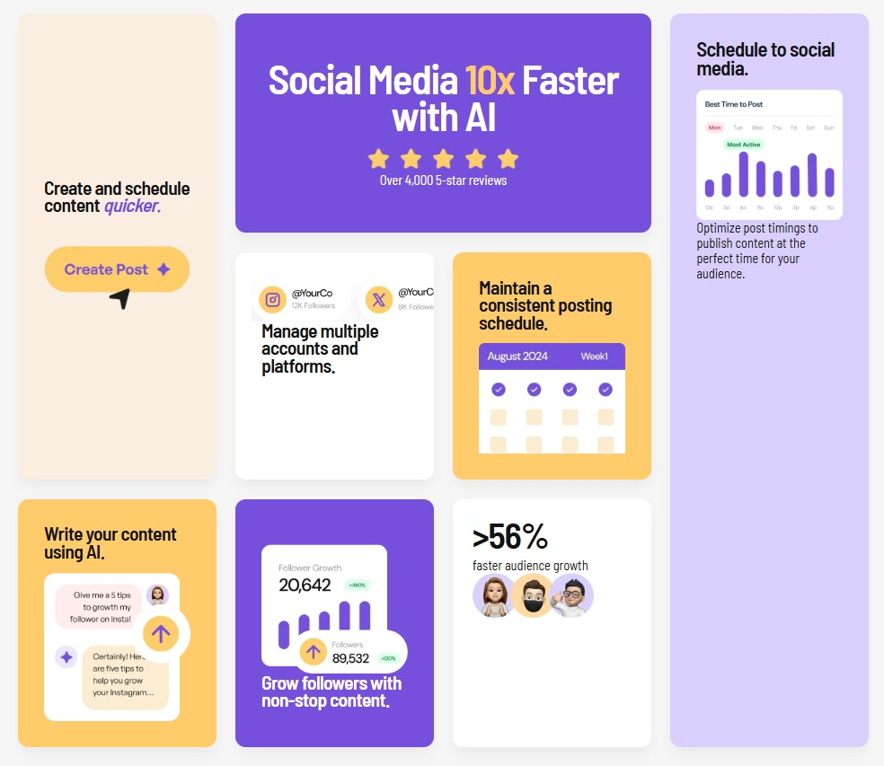

# Bento Grid Challenge - Solution

Esta es mi solución al [Bento Grid Challenge de Frontend Mentor](https://www.frontendmentor.io/challenges/bento-grid-RM9P1w9cH). El objetivo fue construir un diseño de cuadrícula complejo y responsivo utilizando las mejores prácticas de CSS moderno y accesibilidad.

## 🚀 Resumen del Proyecto

El desafío consistió en replicar un diseño de cuadrícula tipo "Bento" (popularizado por Apple), donde las tarjetas tienen diferentes tamaños y posiciones que deben reorganizarse dinámicamente según el dispositivo.

### Captura de Pantalla

*(Nota: Asegúrate de tener una imagen en esa ruta o cambia el link por la URL de tu imagen)*

---

## 🛠️ Tecnologías Utilizadas

* **HTML5 Semántico:** Uso de etiquetas `<main>` y `<article>` para una estructura lógica y accesible.
* **CSS Grid (Layout Principal):** Implementación de `grid-template-areas` para controlar el mosaico en escritorio.
* **Flexbox (Layout Interno):** Para la alineación precisa de contenido e imágenes dentro de cada tarjeta.
* **Diseño Responsivo:** Uso de Media Queries para transformar el grid de 4 columnas a 1 sola en dispositivos móviles.
* **Variables CSS:** Uso de `:root` para gestionar colores oficiales y espaciados consistentes.

---

## 💡 Puntos Clave del Desarrollo

### 1. El Mapa del Grid
Se utilizó un mapa visual en el código para definir la posición de cada tarjeta:
```css
grid-template-areas: 
  "create  social   social   schedule"
  "create  manage   maintain schedule"
  "write   grow     audience schedule";

### 2. Desbordamientos e Imágenes
Para lograr el efecto donde las imágenes parecen salir de la tarjeta o están cortadas:

* **Usamos `overflow: hidden`** en el contenedor de la tarjeta.
* **Aplicamos `transform: translateX()` y `width: 140%`** para posicionar imágenes fuera de su flujo natural sin romper el layout.

### 3. Accesibilidad Pro
No nos limitamos a lo visual. Mejoramos la experiencia para lectores de pantalla mediante:

* **Atributos ARIA:** Uso de `aria-labelledby` para conectar cada tarjeta con su título.
* **Jerarquía de Títulos:** Uso correcto de un único `<h1>` y múltiples `<h2>` para facilitar la navegación por teclado.

## 🧠 Aprendizajes

Durante este reto, profundicé en el uso de la propiedad clamp() para tipografía fluida y aprendí a gestionar diseños de "mosaico" que requieren un control muy estricto del box-sizing y los paddings específicos por sección.

Autor: Maira Hernandez

LinkedIn: https://www.linkedin.com/in/maira-hernandez-650628288/  


# Bento Grid Challenge - Solution

This is my solution to the [Bento Grid Challenge from Frontend Mentor](https://www.frontendmentor.io/challenges/bento-grid-RM9P1w9cH). The goal was to build a complex, responsive grid layout using modern CSS best practices and accessibility standards.

## 🚀 Project Overview

The challenge involved replicating a "Bento" style grid layout (popularized by Apple), where cards have different sizes and positions that must reorganize dynamically based on the user's device.

### Screenshot

*(Note: Ensure you have an image at this path or update the link with your image URL)*

---

## 🛠️ Technologies Used

* **Semantic HTML5:** Use of `<main>` and `<article>` tags for a logical and accessible structure.
* **CSS Grid (Main Layout):** Implementation of `grid-template-areas` to control the mosaic layout on desktop.
* **Flexbox (Internal Layout):** For precise alignment of content and images within each card.
* **Responsive Design:** Use of Media Queries to transform the grid from 4 columns to a single column on mobile devices.
* **CSS Variables:** Use of `:root` to manage official colors and consistent spacing.

---

## 💡 Development Key Points

### 1. The Grid Map
A visual map was used in the code to define the position of each card:
```css
grid-template-areas: 
  "create  social   social   schedule"
  "create  manage   maintain schedule"
  "write   grow     audience schedule";

### 2. Overflows and Images
To achieve the effect where images appear to "pop out" of the card or are cropped:

* **We used overflow: hidden on the card container.

* **We applied transform: translateX() and width: 140% to position images outside their natural flow without breaking the layout.


## 3. Pro Accessibility

We didn't just focus on visuals. We improved the experience for screen readers through:

* **ARIA Attributes: Use of aria-labelledby to connect each card with its title.

* **Heading Hierarchy: Proper use of a single <h1> and multiple <h2> to facilitate keyboard navigation.

## 🧠 Lessons Learned

During this challenge, I deepened my understanding of the clamp() property for fluid typography and learned to manage "mosaic" designs that require strict control over box-sizing and section-specific paddings.

Author: Maira Hernandez

LinkedIn: https://www.linkedin.com/in/maira-hernandez-650628288/